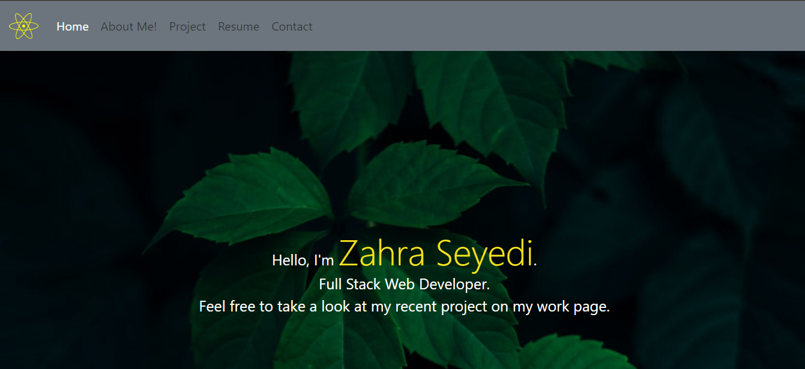

# React Professional Portfolio

This project was bootstrapped with [Create React App](https://github.com/facebook/create-react-app).

## License:

## Contents

- [Description](#description)
- [Installation](#installation)
- [Usage](#usage)

## Description:

Being a web developer means being part of a community. This is a place to share my projects while working as a freelancer and collaborate with other developers on projects.

## Installation:

In the project directory, you can run:

### `npm start`

## Usage:

Visit the website and use the navigation links to see the different sections of the app.

## Contact:

- Github: [zahra315](https://github.com/zahra315)
